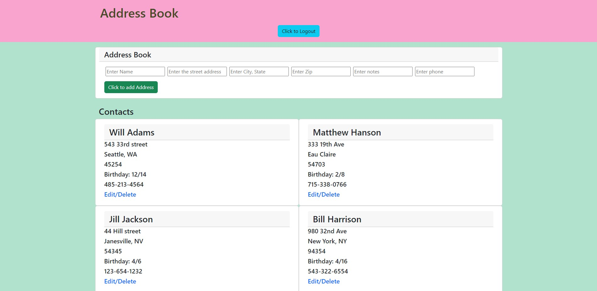
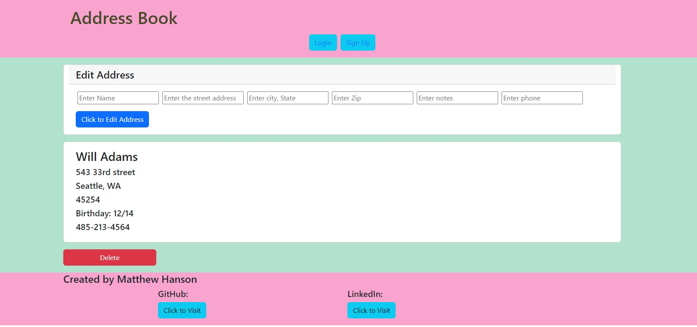

# Address Book

## Description

Address book is a MERN Full-Stack web app for saving contact information of your friends and family.  Whether you want to send an invitation or a gift, just pull up address book on any device and find everything you need!  Apart from creating data the user can also easily update and delete any contact.  React and bootstrap implemented with JSX brought the front-end to life. The backend is written in Node and uses Express to connect and route frontend functionality.  Express then processes frontend data and stores it in a secure MongoDB.

## Table of Contents 

- [Installation](#installation)
- [Usage](#usage)
- [Credits](#credits)
- [License](#license)

## Installation

For local install, clone the repository to your machine, open the terminal in your code editor and run "npm i"

## Usage

Log in at [https://thawing-dawn-74627.herokuapp.com/](https://thawing-dawn-74627.herokuapp.com/)

For local development you can use the develop script "npm run develop" to connect locally to MongoDB Compass.

## Credits

Sole Contributor: Matthew Hanson

## License

MIT License

